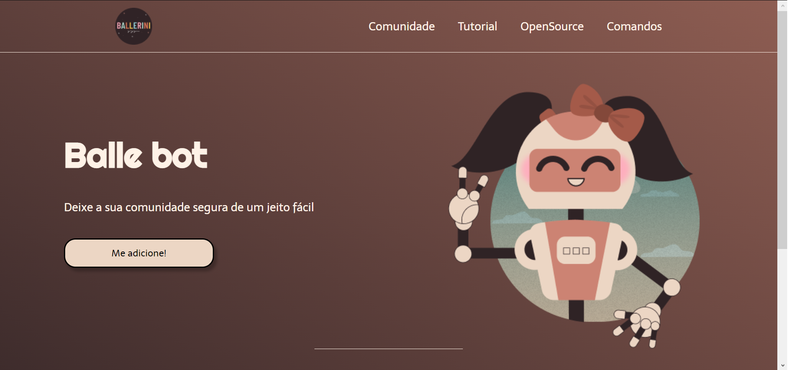

<h1 align="center"> Balle bot 💻 </h1>

## Briefing 📄

Website para um bot do discord proposto por Rafaela Ballerini.

O link para a comunidade da Rafaela para mais detalhes sobre o trabalho dela:

> [discord](https://discord.gg/ballerini)

<h2 align="left"> Objetivos 📌 </h2>

- Melhorar skills como front-end developer

---

<h3 align="center"> HOME 📷 </h3>

<h3 align="center"> Tecnologias utilizadas 🤖 </h3>

> 

